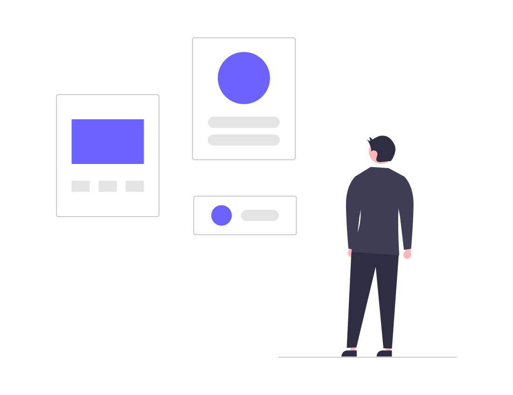

	<h1>Frontend System Design Guidev</h1>
	<h3>Interview checklist & style guide</h3>
    	

    

      
      
      
      
    

---

### What is this Frontend System Design guide about?

Frontend System Design guide attempts to cover the various factors to be considered while architecting a complex large-scale frontend application from scratch. Also guide acts like a checklist that can be used as a reference for frontend system design. The guide aims to contain the breadth of the frontend systems while giving the directions to explore in depth for both individual contributors and system architects.

	Guide is generic and not biased towards any library or framework

- [Engineering Design](#engineering-design)
- [High Level Design](#high-level-design)
- [Low level Design](#low-level-design)

---

### Engineering Design

- Team size
- User base
- Knowledge base
- Compliance/Governance
- User/Client expectations
- Open source vs proprietary
- Documentation / PRD
- Future Roadmaps

---

### High Level Design

- Platform identification
- SPA vs MPA
- SSR, SSG, CSR
- Tech stack
- Search Engine Optimization
- CI/CD
- User Experience
- A/B testing
- MVP planning
- Server Side Architecture
- Security
- State Management
- Internationalization
- E2E testing
- Tools Integration
- Authentication & Authorization
- Quality Assurance & Control
- User role management

---

### Low Level Design

- Code/Folder architecture
- Desktop/Mobile first approach
- System breakdown
- Component Design
- Form development
- Storage management
- API Design
- Instrumentation
- Design system
- Routing management
- CSS optimizations
- Lazy loading of modules
- Accessibility
- Image optimizations
- Pagination, Debouncing, Throttling
- Performance: FCP, LCP, TTI, CLS
- Versioning
- Unit testing

---

### High Level Design details

 

**Product Requirement Document (PRD) / Design Document**
- Identify Scope/Requirement
- Review your understanding with stakeholders

 

**Discuss about Design/Wireframe**
- Think like an architect.
- We should not consider team bandwidth, capacity and time.
- Discuss about Edge cases.
- Robustness: Handle SPOF (Single Point of Failure) ex: Monitoring, Logging

 

**Identify Business**
- Is it B2B (business-to-business)?
- Is it B2C (business-to-consumer)?
- Is it Internal Product?
- Is it Customer facing product?

 

**Identify Platform**
- Desktop
- Mobile
- Tablet

 

**Identify Users (Know your audience)**
- Conduct surveys
- Discuss about Location and Devices
- Internet speed
- End Users knowledge base (ex: Technical user)
- Pilot Product (sometimes to understand audience)

 

**Identify Design Approach**
- Responsive vs Adaptive design
- Desktop first vs Mobile first

 

**Identify APIs**
- Rest APIs / Graph APIs / RPC
- JSON / Protocol buffers

 

**Role based management**
- Large system needs roles based access and permissions
- Authentication and Authorization
- Read/Write/View Permissions
- Discuss about Routes/Component access

 

**Identify Right Platform (compare frameworks based on the use case)**
- Single Page Applications (Unsuitable for Blogs/News based products)
    - No reloading of a page at navigation
    - No SEO
- Multi Page Applications
    - Reloading of a page at every page navigation.
- Progressive Web Applications
    - Provides offline support and native like functionality.
- Server Side Rendering
    - Better SEO
- Important points to discuss:
    - Are users on mobile?
    - Is SEO needed?
    - Is SPA enough?
    - Is PWA enough? (Service worker, Web Worker)
    - Compare SSR / SSG / CSR
    - Any Pricing model? (optional) - Subscriptions based, Paid APIs 
    - Will my app be Frontend heavy? (or backend heavy)
    - Do I have resources for this skill?
    - Is your application Canvas (or SVG) heavy? (Figma, Draw.io)
    - Is your application webRTC heavy? (Video streaming)

 

**Identify User Flow**
- Discuss vision of a product.
- Do we need to build from scratch or we can leverage some existing functionalities
- Discuss about authentication and authorization (Google auth / OAuth)
- Interact with the Product manager to understand the scope before designing the application.
- Discuss happy scenarios.
- Discuss edge cases.
- Discuss failing scenarios

 

**Identify MVP (Minimum Viable Product)**
- Problem -> Solution -> Build MVP -> MVP to Customers
- Discuss MVP phase with product manager
- Discuss roadmaps and divide product in milestones
- After MVP release there can be a slight change in design/approach to make the product better

 

**Volume of Operations**
- Discuss about the end users of the product
- Identify QPS (Queries per second)
- Discuss about Load testing/Stress testing
- Inject analytics in application (ex: Google analytics, Sentry, NewRelic)
- Analytics data helps us to scale the system

 

**SEO (Search Engine Optimization)**
- Crawling
- Use of Heading tags
- Semantic tags
- Site Ranking
- Sitemap
- Meta Keywords
- Organic approach vs Inorganic approach
- Use of alt tags
- 301 Redirects (bad for SEO)
- Robots.txt
- Open graph protocol (https://ogp.me/) for social graph

 

**Component Based Design**
- Component wise deployment cycle (CI/CD)
- Monolith vs Microservice architecture
- Micro Frontend (independent dev & deployment for scalability)
- Static components vs Dynamic components 
- IFrame/Shell approach

 

**State Management**
- How to maintain state through the application?
- How to manage users' data?
- State management Libraries (Redux, Flux, NgRX)

 

**Handling APIs**
- Polling (Short and Long)
- Web Sockets (Real-time) (ex: chat, shared editors)
- Batch requests
- GraphQL
- Caching GET APIs (Middleware concepts to cache response)
- Server-Sent Events (SSE)

 

**Optimizing Images**
- Add alt attributes (Images should be descriptive for SEO)
- Load images based on screen size (img srcset)
- Image compression (ex: JPEG 2000)
- Image sitemaps
- Use SVGs for generic dimensions (in case of stretching of images)
- Discuss about image Sprites for icons
- Discuss about progressive images (ex: Medium.com)

 

**Instrumentation**
- Measurement and tracking are key for a stable system
- Monitoring
- Error logging (for tracing)
- Debugging
- Logs/Track all events happened in the application
- Implement Analytics (GA)
- Sentry (to capture errors)
- Newrelic (to detect failures)

 

**Versioning of artifacts**
- Artifacts tracking (ex: Confluence)
- Rollback & backup mechanisms

 

**Performance Optimization Techniques**
- Webpack to optimized/compressed pages (Code splitting)
- Web Vitals (FP, LCP, CLS, etc)
- Lighthouse / PageSpeed Insights
- Fast Loading (Initial load should be fast)
- Smooth Opherations (Loading indicators / Light/Smooth/Meaningful animations (to avoid jerks in transitions) / Splash screens) - (dialog with light animations)
- Animation directions should be the same (dialog coming from bottom should close in bottom) - (smooth animation should be added in sidebars for better UX)
- Animation between data fetching(APIs request)
- Discuss about Caching - ex: API, resource cache (Browser cache / Memory / CDN / Disk Cache)
- Pagination vs Infinite Scroll
- Meaningful animation
- Micro interactions

 

**Internationalization (i18n) / Localization (i10n)**
- Localization
- Numeric, date and time formats
- Singular &  Plurals
- Use of currency
- Keyboard usage
- Symbols, icons and colors
- Text and graphics vary with different languages and religions, may be subject to misinterpretation or viewed as insensitive
- Varying legal requirements

 

 **Accessibility**
- Alt attributes
- Aria-labels
- Multi-device support, slow network speed
- Color contrast, semantics tags

 

**Security**
- MITM
- XSS
- CSRF
- Clickjacking
- Content Security Policy (CSP)
- CORS

 

**Quality assurance and control**
- Stable products are successful
- Specify standards - Code level / Artifacts level / Asset level
- Git Hooks (pre commit hooks, husky)
- Linters / Static Analyzers
- Unit testing
- Workflow testing (User level flows) (Tools - Cypress)
- Integration testing
- Automation suite
- Cross browsers testing
- Cross platform testing

 

**Governance**
- Controlling the workflows and protecting the assets
- UX Design -> Developers -> Product Managers -> UX Designing -> QA
- Code level governance - like PRs approval (sets standard in your team)
- Artifacts/Assets level governance (before go live)
- like Product Manager approval, Stakeholders approvals

 

**Experiment based release cycle**
- Experiment flag, which can help in the release cycle

 

**NFR (Non Functional Requirement)**
- Discuss about CI/CD (Docker, Pipeline)
